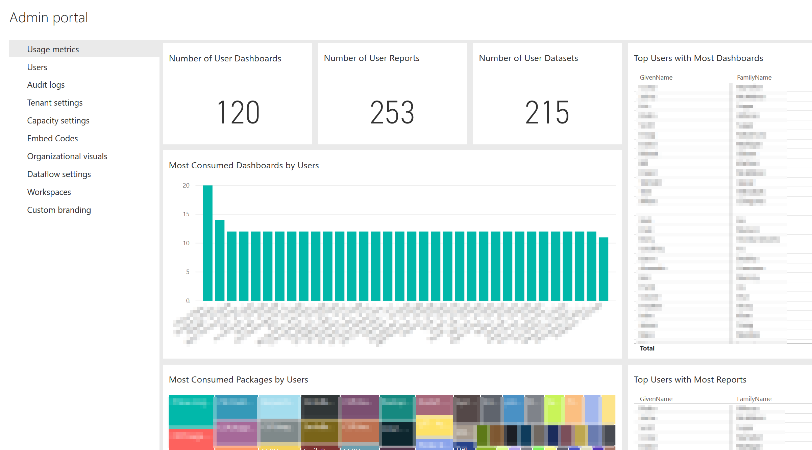
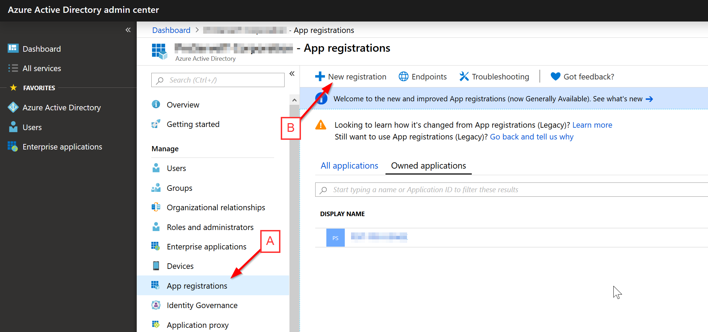
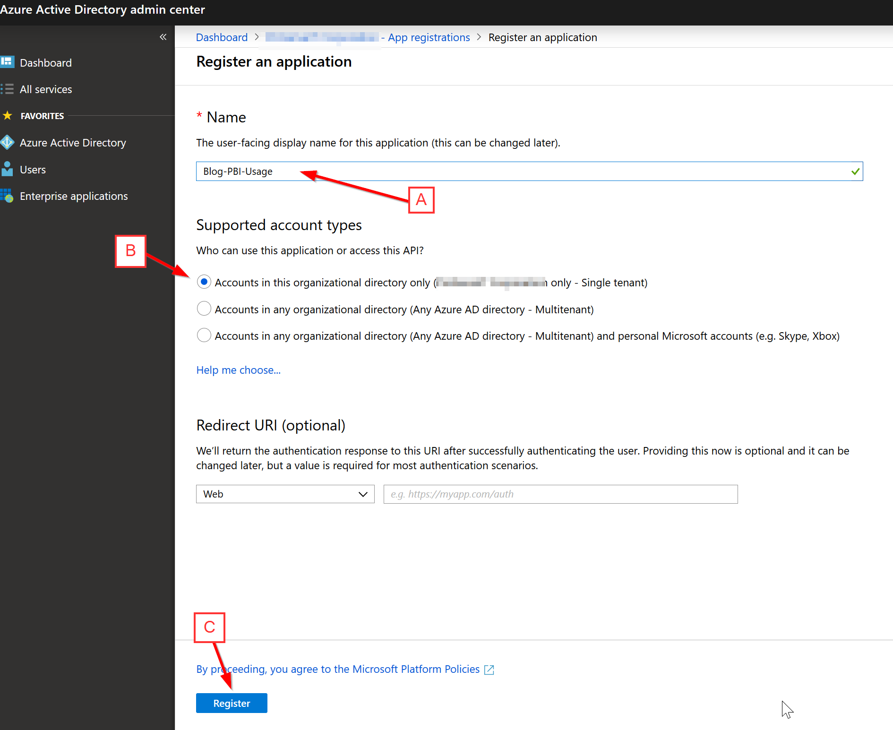
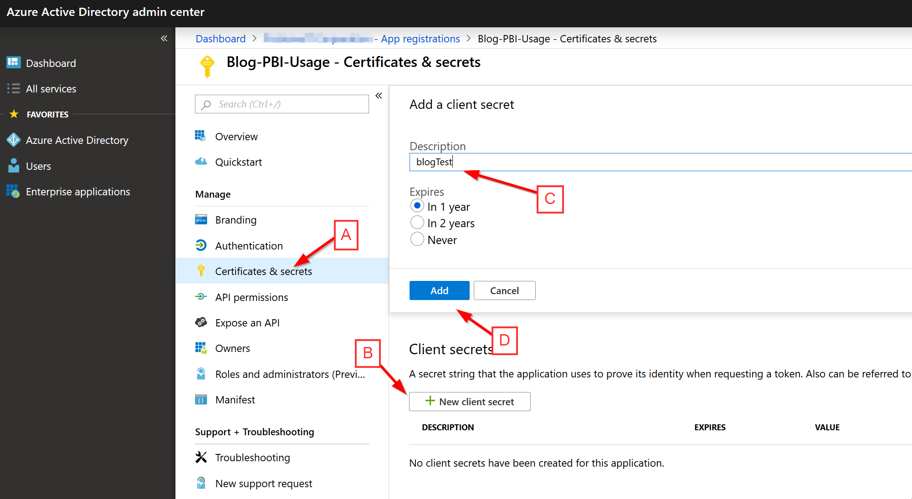

# Power BI Usage Report
###### by [Scott Sugar](https://linkedin.com/in/scottsugar)

## Problem Statement
"You can't manage what you can't measure".  So when it comes to managing your tenant's online Power BI service, how do you measure the usage of your reports, dashboards, and datasets?  Which reports are getting the most attention?  By who?  Are there unused reports or workgroups that could be cleaned up?

The online PowerBI service does offer "Usage metrics" in the Admin portal, but it's not customizable or interactive, and seems to be more focused on "who has how many reports/dashboard" rather than the question I set out to answer "who's using the service, and what are they looking at?"

Power BI Built-In Usage Metrics:

## Solution Walkthrough

### Set up Pre-Requisites
We have a few things we need to set up in order to get this solution working:
* Azure AD Application - to help us authenticate to the O365 Management APIs
* Power BI Streaming Dataset - to hold the Power BI activity logs

#### Azure AD Application

1. Login to Azure AD Admin Portal and Create a new Azure AD Application
   A) Click App Registrations
   B) Click New Registration

2. Register Azure AD Application
   A) Enter Application Name
   B) Select Supported Acccount Types (default is fine if just gather activity logs for one tenant)
   C) Click Register

#### Power BI Streaming DataSet

### Get-PowerBIUsage Script

#### Update Script

#### Run Script

#### Loop Script

### Create Power BI Report

## Get Started with MS Power BI Today
There are so many things MS Power BI can do to increase data visibility and improve decision making within your organization. So, let’s recap a few important points about why you need MS Power BI in your organization.

MS Power BI is data import, modeling, and visualization made easier.  It can be a self-service data visualization tool for your end-users, or we can help build reports and dashboards for you.  MS Power BI has desktop and mobile clients - even for Apple Watch - along with web-based dashboards and reports, making your data and KPIs easy to access from any device at any time.

Simply put, MS Power BI is an extremely versatile Business Intelligence platform. If you want to learn more about how to take full advantage of MS Power BI, [drop us a line today](mailto:cloud@proserveit.com?Subject=I%20Want%20To%20Learn%20More%20About%20Power%20BI%20Solutions). Our team of Data & Analytics experts will be happy to schedule a demo or a tutorial session.