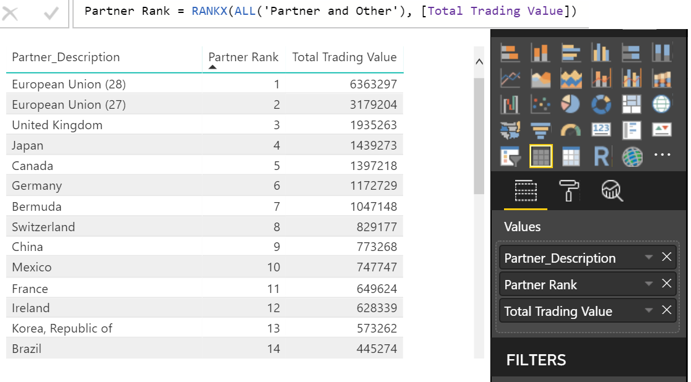

# PowerBI TopN and Other

## Problem Statement
Power BI has the ability to display the Top N within a visualization by using a visual level "Top N" filter.  There currently (Nov 2018) isn't any built-in functionality to show the Top N and aggregate the rest of the categories under an "Other" category.  

## Example Data
We're going to use US services trade data to show how to get Top N and Other working in Power BI.  Data is taken from here:
[full trade data](https://www.wto.org/english/res_e/statis_e/trade_datasets_e.htm)

To reduce the overall size of the trade data we're working with, we've filtered the data taken from the site above down to just data reported by the US.  The actual CSV file we're going to be working with is located here:
[US services trade data](exampledata/US-Services-TradeData.csv)

## Solution Walkthrough
To build this solution, we've loaded the example data [US services trade data](exampledata/US-Services-TradeData.csv) into Power BI.  No further changes to this data have been made.

### Create a Calculated Table with Trade Partners and Other
To start, we're going to create a Calculated Table (Modeling > New Table).  The DAX expression for this table will be:

````
Partner and Other = UNION(VALUES('US-Services-TradeData'[Partner_Description]), ROW("Partner_Description", "Other"))
````

This DAX expresssion creates a new table with all the trading partners, and an extra row at the end with a value of "Other"


### Create a Measure to Sum all Trading Value
Our next step is to create a new Measure (Modeling > New Measure).  The DAX expression for this measure will be:

````
Total Trading Value = CALCULATE(SUM('US-Services-TradeData'[Value]))
````

This DAX expression creates a new measure with the sum of trading value.  Creating this as a measure allows us to use it in further calculations without having to reference the US-Services-TradeData table.

### Create a Measure to Rank all Trading Partners by Trading Value
We'll now use our "Total Trading Value" measure to create a new Measure (Modeling > New Measure) to Rank all trading partners.  The DAX expression for this measure will be:

````
Partner Rank = RANKX(ALL('Partner and Other'), [Total Trading Value])
````

With the above 3 measures in place, we are now able to create a table that shows each trading partner, it's rank by trading value, and it's trading value:
