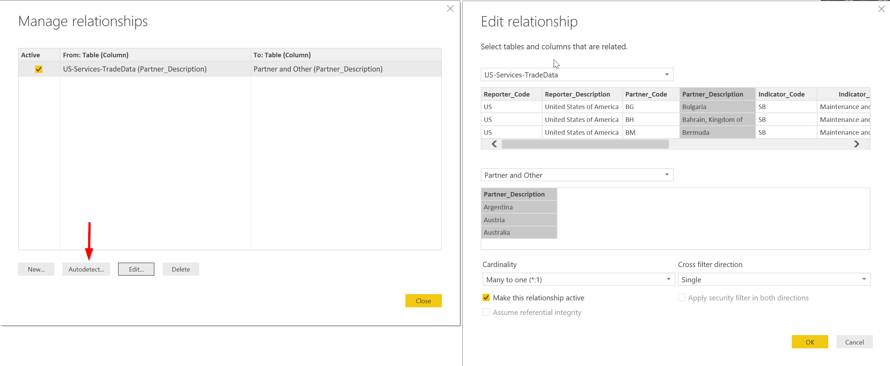

# PowerBI TopN and Other

## Problem Statement
Power BI has the ability to display the Top N within a visualization by using a visual level "Top N" filter.  There currently (Nov 2018) isn't any built-in functionality to show the Top N and aggregate the rest of the categories under an "Other" category.  

## Example Data
We're going to use US services trade data to show how to get Top N and Other working in Power BI.  Data is taken from here:
[full trade data](https://www.wto.org/english/res_e/statis_e/trade_datasets_e.htm)

To reduce the overall size of the trade data we're working with, we've filtered the data taken from the site above down to just data reported by the US.  The actual CSV file we're going to be working with is located here:
[US services trade data](exampledata/US-Services-TradeData.csv)

## Solution Walkthrough
To build this solution, we've loaded the example data [US services trade data](exampledata/US-Services-TradeData.csv) into Power BI.  No further changes to this data have been made.

### Create a Calculated Table with Trade Partners and Other
To start, we're going to create a Calculated Table (Modeling > New Table).  The DAX expression for this table will be:

````
Partner and Other = UNION(VALUES('US-Services-TradeData'[Partner_Description]), ROW("Partner_Description", "Other"))
````

This DAX expresssion creates a new table with all the trading partners, and an extra row at the end with a value of "Other"


### Create Relationship
Once we've created the Calculated Table "Partner and Other", we next need to create a relationship between the Calculated Table and the original "US-Services-TradeData" table.  To do that, we click on Home > Manage Relationships in Power BI, and then click on Autodetect.  That should generate the relationship we need.


### Create a Measure to Sum all Trading Value
Our next step is to create a new Measure (Modeling > New Measure).  The DAX expression for this measure will be:

````
Total Trading Value = CALCULATE(SUM('US-Services-TradeData'[Value]))
````

This DAX expression creates a new measure with the sum of trading value.  Creating this as a measure allows us to use it in further calculations without having to reference the US-Services-TradeData table.

### Create a Measure to Set How Many In Our Top N
Now we're going to create a measure, which is effectively going to be a variable that will hold how many items we want in our Top N.  Here is the DAX expression:

````
TopX = 10
````

### Create a Measure to Rank all Trading Partners by Trading Value
We'll now use our "Total Trading Value" measure to create a new Measure (Modeling > New Measure) to Rank all trading partners.  The DAX expression for this measure will be:

````
Partner Rank = 
//If we are looking at the "Other" category, then set the rank to be 1 higher than our TopX meausre, else give us the rank of the category by trading value
IF(SELECTEDVALUE('Partner and Other'[Partner_Description]) = "Other", [TopX] + 1, RANKX(ALL('Partner and Other'), [Total Trading Value]))
````

Note: If we don't set the "Other" categories rank, it will have a rank matching the lowest categories rank.

With the above measures and relationship in place, we are now able to create a table that shows each trading partner, it's rank by trading value, and it's trading value:

Note: The Partner_Description field used is from the "Partner and Other" calculated table

### Create a Measure to aggregate all categories outside of the Top N into the "Other" category
Now we get to the meat of the solution.  We're going to create another DAX measure (Modeling > New Measure) to aggregate all categories outside of the Top N, or return the categories total value if it's within the Top N:

````
Top Trading Partner and Other = 
//Set the number of items we want in the Top N
var X = 10 
//If a category is ranked within the Top N, give us the value for that category.
return if([Partner Rank] <= X, [Total Trading Value],
    //else we're outside the Top N, and we're looking at the "Other" category, aggregate the value for all categories outside the TopN
	if(SELECTEDVALUE('Partner and Other'[Partner_Description]) = "Other", sumx(filter(all('Partner and Other'[Partner_Description]), [Partner Rank] > X),  [Total Trading Value])
    )
)
````

### Create a bar or column chart visualization
Now we get to finally create our visualization.  For our axis, we're going to use "Partner_Description" from our "Partner and Other" calculated table.  Our value will be the "Top Trading Partner and Other" measure we created.  We're also going to add in "Partner Rank" as our tooltip.  This will allow us to sort the chart by "Partner Rank" so our top categories will show up first, and our "Other" category will show up last.  To do that, make sure you sort the visualization by "Partner Rank" ascending.  Finally, make sure set the Visual Level Filter with "Top Trading Partner and Other" > 0 so categories with no data don't show up.

